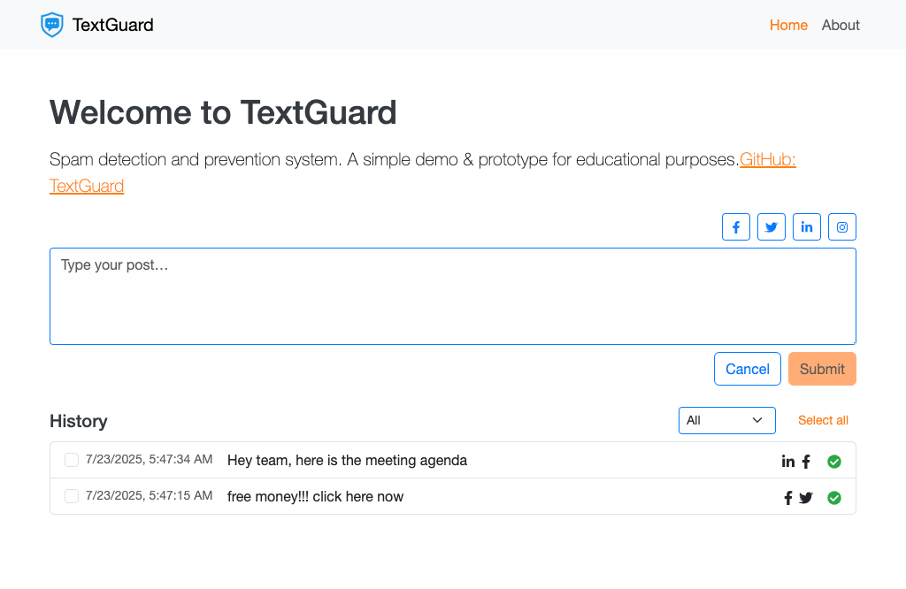

# TextGuard



**Live Demo:** <https://textguard.chrishacia.com>

A tiny spam detection demo built with **TypeScript**, **React (Vite)**, and **Express**.
No LLMs—just heuristics + a Naive Bayes classifier trained on a small labeled dataset.

> Created as a personal learning exercise and assessment for a potential job.

## Features

- **Client**
  - Textarea posting UI with platform icon toggles (Facebook, X/Twitter, LinkedIn, Instagram)
  - Submit button enabled only when text and a platform are selected
  - Result banner (spam / not spam)
  - History list with filter (“All / Spam / Not Spam”), bulk delete, accordion details
  - Responsive navbar (no Bootstrap JS)
- **Server**
  - `/api/score` accepts `{ text, platforms }`
  - Normalizes text, applies heuristics (links, exclamations, profanity), Naive Bayes probability
  - Returns `{ score, isSpam, platforms }`

## Quick Start (Development)

```bash
git clone git@github.com:chrishacia/TextGuard.git
cd TextGuard
npm install
npm run dev
```

- Client: <http://localhost:5173>
- API: <http://localhost:4000> (proxied in dev; client calls `/api/...`)

## Environment Variables

Create a `.env` in the project root:

```bash
PORT=4000
SPAM_HEURISTIC_WEIGHT=0.5
SPAM_THRESHOLD=0.6
SERVER_DOMAIN=textguard.chrishacia.com
SERVER_PROTOCOL=https
```

All have sensible defaults—tweak as desired.

## Build & Run (Production)

```bash
npm install
npm run build       # Builds client and server, copies client output into server/dist/public
npm start           # Starts Express on PORT (default 4000)
```

Or with PM2:

```bash
pm2 start ecosystem.config.cjs --env production
```

## Manual Deploy (Ubuntu / PM2 / Nginx)

1. **Clone & Install**

   ```bash
   cd /var/www
   git clone git@github.com:chrishacia/TextGuard.git textguard.chrishacia.com
   cd textguard.chrishacia.com
   npm ci --workspaces
   ```

2. **Build**

   ```bash
   npm run build
   ```

3. **Start with PM2**

   ```bash
   pm2 start ecosystem.config.cjs --env production
   ```

4. **Configure Nginx**
   - Redirect HTTP → HTTPS
   - Proxy `textguard.chrishacia.com` to `http://127.0.0.1:4000`
   - Serve client via Express

5. **Enable SSL**

   ```bash
   certbot --nginx -d textguard.chrishacia.com
   ```

---

### Sample Nginx Server Block

```nginx
server {
    listen 80;
    server_name textguard.chrishacia.com;
    return 301 https://$host$request_uri;
}

server {
    listen 443 ssl http2;
    server_name textguard.chrishacia.com;

    ssl_certificate /etc/letsencrypt/live/textguard.chrishacia.com/fullchain.pem;
    ssl_certificate_key /etc/letsencrypt/live/textguard.chrishacia.com/privkey.pem;
    include /etc/letsencrypt/options-ssl-nginx.conf;
    ssl_dhparam /etc/letsencrypt/ssl-dhparams.pem;

    location / {
        proxy_pass http://127.0.0.1:4000;
        proxy_http_version 1.1;
        proxy_set_header Upgrade $http_upgrade;
        proxy_set_header Connection 'upgrade';
        proxy_set_header Host $host;
    }
}
```

## Project Structure

```
/
├─ dist/                   # Built client (Vite)
├─ server/
│  ├─ dist/                # Built server
│  └─ src/                 # Server source
├─ scripts/                # Deployment scripts
├─ package.json
├─ ecosystem.config.cjs
├─ .env
└─ README.md
```

## License

MIT © Christopher Hacia <https://chrishacia.com>
